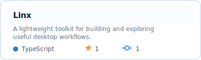
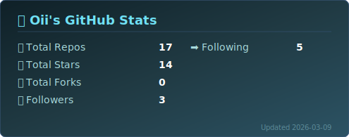
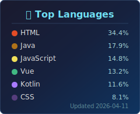

### 👋 About Me

Hi, I'm Owl23007 (沃以), a tinkerer from Wuhan, China.
> Building weird tools, one curiosity at a time.

  

    
    
    
  

### 🧪 Learning

  
  
  
  
  
  
  
  

### 🏗️ WIP

### 📈 Stats

  

    
 <href="https://github.com/Owl23007">
    
  

### 📮 Contact Me

 
