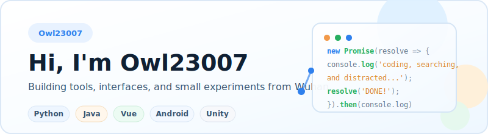
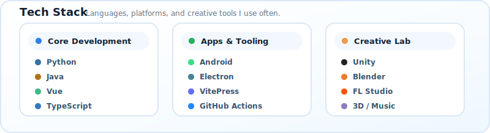
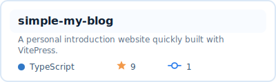
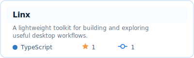
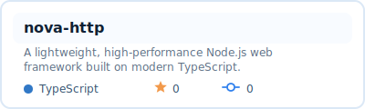
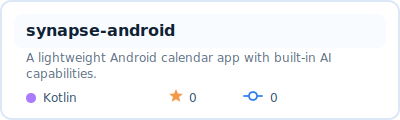
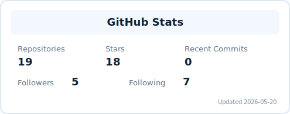
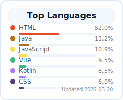

  

  
  
  

## 👨‍💻 About Me

你好，这里是**沃以**。我喜欢把微小的灵感转化为实用的工具、有趣的交互界面，以及帮我摸透事物运行逻辑的实验。

🔧 **技术栈：** Python · Java · Vue · Android · 桌面端工具  
🎨 **创作领域：** 游戏开发 · 3D 创作 · 音乐制作  

我热衷于工程实现与交互设计的交汇处。始于好奇，偶尔会跑偏，但最终总能顺利 `resolve` 。欢迎交流与 PR！✨

---

Hi, I'm **Owl23007**. I like turning small ideas into practical tools, playful interfaces, and experiments that help me understand how things work.

🔧 **Core Stack:** Python · Java · Vue · Android · Desktop Tooling  
🎨 **Creative Side:** Game Dev · 3D Creation · Music Production  

I thrive at the intersection of engineering and interactive design. Curious, occasionally distracted by docs & details, but always resolved. Open to collaboration & PRs! ✨

  

### Featured Projects

  
  
  
  

### GitHub Stats

  
  

### Connect

  

